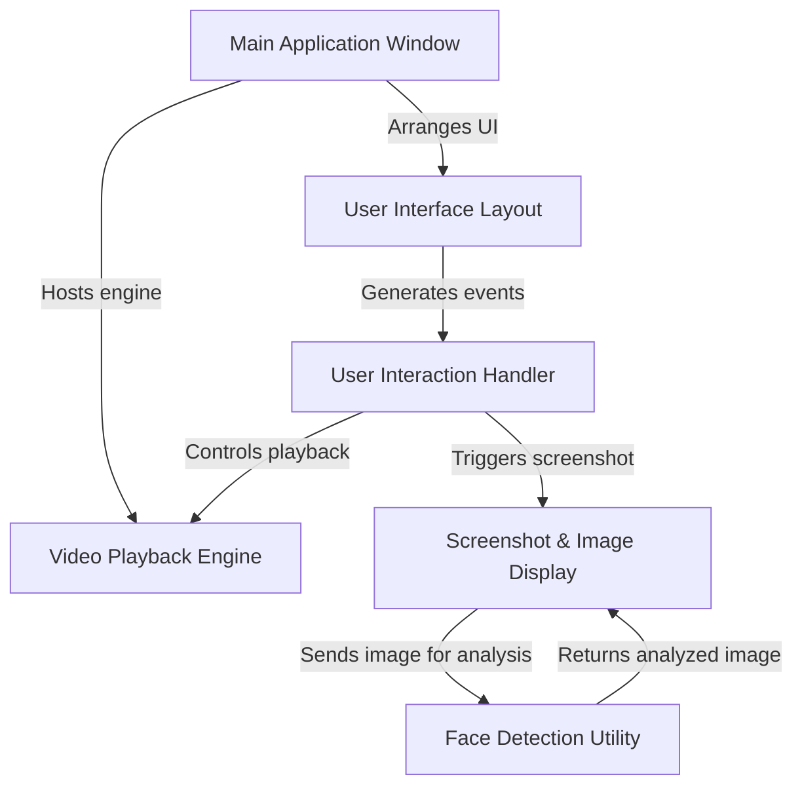
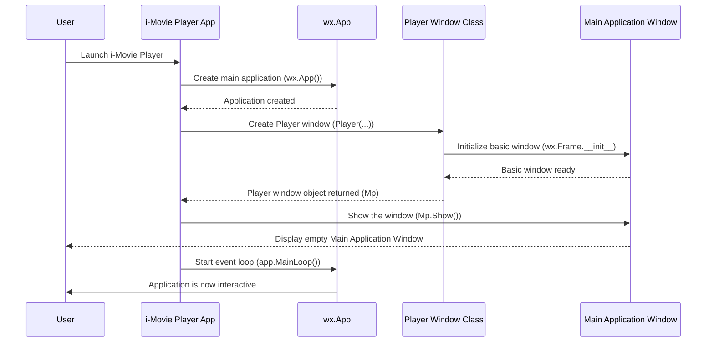
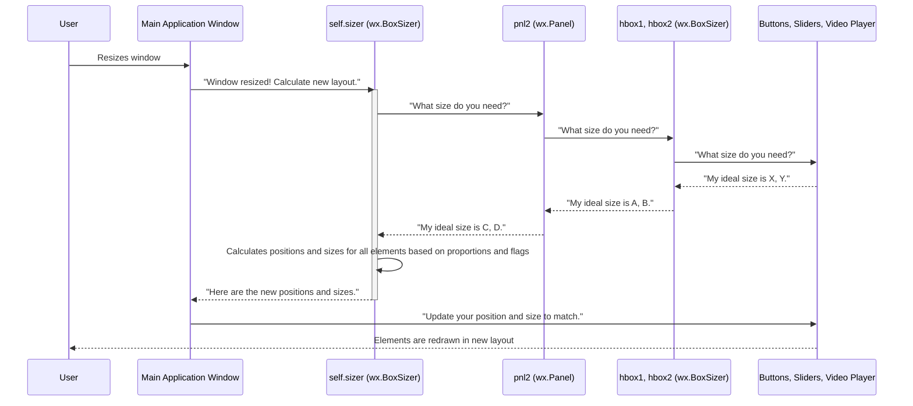
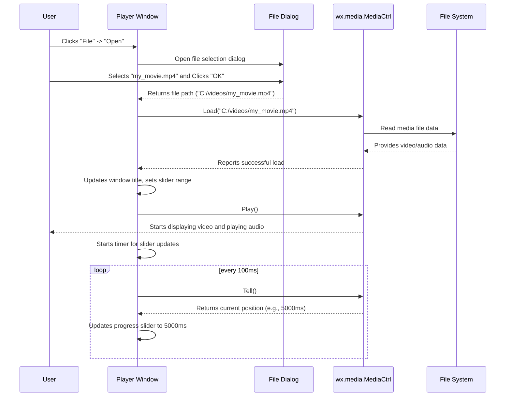
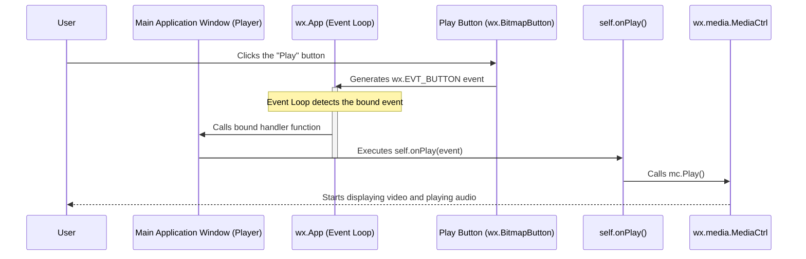
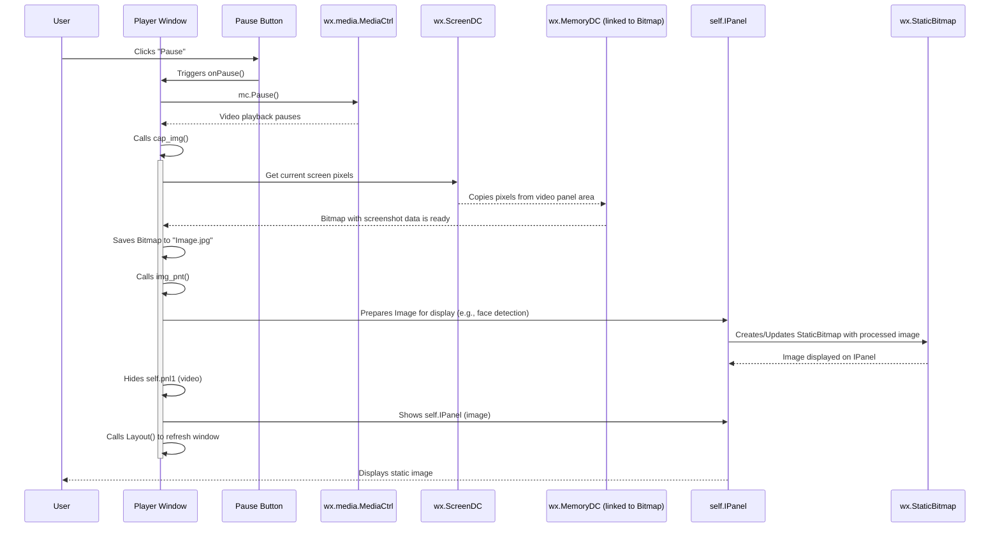
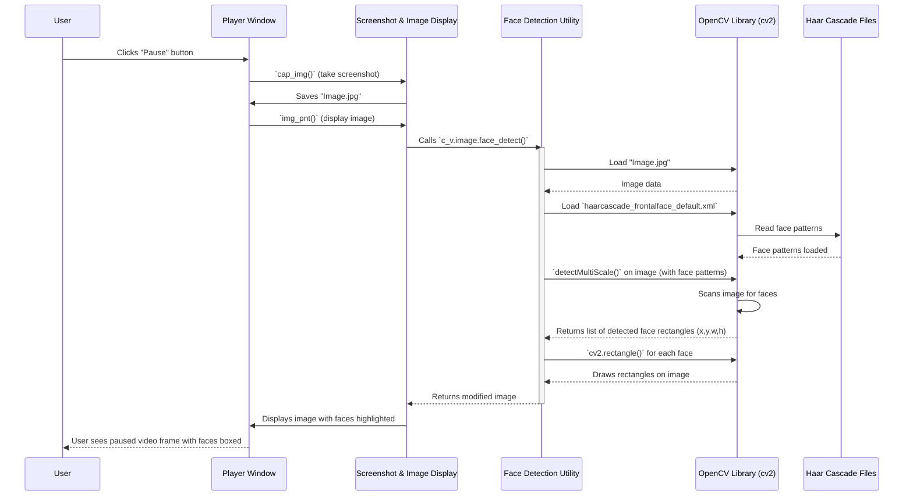

# i-media-player

This project is an **i-Movie Player**, a desktop application designed to *play video and audio files*. It offers a user-friendly graphical interface with controls for media playback and volume adjustments. Beyond basic media functions, it uniquely features the ability to *capture screenshots* from the playing video, and then *apply face detection* to those captured images, highlighting any identified faces.


## Visual Overview



## Chapters

1. [Main Application Window
](01_main_application_window_.md)
2. [User Interface Layout
](02_user_interface_layout_.md)
3. [Video Playback Engine
](03_video_playback_engine_.md)
4. [User Interaction Handler
](04_user_interaction_handler_.md)
5. [Screenshot & Image Display
](05_screenshot___image_display_.md)
6. [Face Detection Utility
](06_face_detection_utility_.md)

---
# Chapter 1: Main Application Window

Welcome to the exciting world of `i-Movie Player`! In this first chapter, we're going to explore the very foundation of our application: the **Main Application Window**. Think of it as the central command center of our spaceship – it's where everything important happens and where you, the user, interact with all the features.

### Why Do We Need a Main Window?

Imagine trying to drive a car where the steering wheel, gas pedal, brakes, and rearview mirror are all separate, floating pieces! It would be impossible to control. Similarly, a software application needs a central place to bring all its parts together.

The **Main Application Window** solves this problem by providing a single, organized container for:
*   The video player itself.
*   Buttons like Play, Pause, Next, Previous.
*   Menus (File, Play, View, etc.).
*   Sliders for volume and video progress.
*   And eventually, more advanced tools like face detection.

It's the primary way you'll see and interact with `i-Movie Player`. Our main goal for this chapter is to understand how this central hub is created and displayed when you launch the application.

### Understanding the Main Window: `wx.Frame`

In our `i-Movie Player` project, the **Main Application Window** is built using a powerful tool called `wx.Frame`. If you're new to programming, `wx.Frame` is like a special blueprint for creating top-level windows in an application. It provides the basic structure for things like a title bar, borders, and the ability to be moved or resized on your screen.

Let's look at the very core code that defines our main window. Don't worry if it looks a bit complex at first; we'll break it down piece by piece.

```python
# i_Movie_Player.py

import wx

class Player(wx.Frame):
    def __init__(self, parent, id, title):
        # This line calls the initializer of the wx.Frame blueprint
        wx.Frame.__init__(self, parent, id, title, size=(350, 300))
        # More code here later to add buttons, menus, etc.
```

In this snippet:
*   `import wx` brings in the `wxPython` library, which helps us create graphical user interfaces (GUIs).
*   `class Player(wx.Frame):` means our `Player` class (which *is* our `i-Movie Player` application) inherits all the basic window features from `wx.Frame`. It's like saying our spaceship control panel `Player` is a special type of `wx.Frame`.
*   `def __init__(self, parent, id, title):` is a special method that runs when a `Player` window is first created. It's like the assembly instructions for our control panel.
*   `wx.Frame.__init__(self, parent, id, title, size=(350, 300))` is where we actually tell `wx.Frame` to set up the basic window. We give it a `title` (which will appear in the window's title bar, like "i-Movie Player") and a starting `size` (350 pixels wide by 300 pixels tall).

### Launching the Application

So, we have a blueprint for our main window, but how do we actually make it appear on the screen and start running? That's where the application's main entry point comes in.

```python
# i_Movie_Player.py

# ... (previous code for Player class) ...

if __name__ == '__main__':
    app = wx.App() # 1. Create the application itself
    Mp = Player(None, -1, "i-Movie Player") # 2. Create an instance of our Player window
    Mp.Show() # 3. Make the window visible
    app.MainLoop() # 4. Start the application's main loop
```

Let's walk through these important steps:
1.  `app = wx.App()`: Before you can display any `wxPython` windows, you need to create a `wx.App` object. This is like turning on the main power for our application. It handles all the background tasks that make your GUI work.
2.  `Mp = Player(None, -1, "i-Movie Player")`: This line creates an actual instance of our `Player` class. We're telling the program, "Okay, now build me one of those `Player` windows with the title 'i-Movie Player'!" This window is stored in a variable named `Mp`.
3.  `Mp.Show()`: By default, a newly created window is hidden. This command makes our `Mp` window appear on your screen. This is when you'd first see the `i-Movie Player` window!
4.  `app.MainLoop()`: This is the heart of any `wxPython` application. It starts what's called the "event loop." This loop constantly checks for things like mouse clicks, keyboard presses, or other user interactions. It keeps the application running and responsive until you decide to close the window.

### What Happens When You Launch `i-Movie Player`?

Let's visualize the steps from launching the application to seeing the main window.



This sequence shows how the user launching the app kicks off a chain of events that leads to the main window being displayed and the application becoming ready for interaction.

### Conclusion

The **Main Application Window** is the cornerstone of the `i-Movie Player`. It's defined by the `Player` class inheriting from `wx.Frame`, and it's brought to life by the application startup code that creates a `wx.App`, then an instance of our `Player` window, displays it, and finally starts the `wxPython` event loop. This window, though initially empty, is the canvas upon which we will build all our media player's features.

Now that we have our main window up and running, the next logical step is to arrange all the interesting components – like the video player, buttons, and sliders – inside it!

Let's move on to discover how we organize everything within this window in the next chapter: [User Interface Layout](02_user_interface_layout_.md).

---
# Chapter 2: User Interface Layout

Welcome back, future media player master! In [Chapter 1: Main Application Window](01_main_application_window_.md), we learned how to create the main window for our `i-Movie Player` application. We now have a blank canvas, a basic window ready to appear on your screen.

But what good is an empty window? Not much! Imagine driving a car where you have a dashboard, but no steering wheel, no gas pedal, no speedometer – just a blank panel. It wouldn't be very useful, would it?

This brings us to the exciting topic of **User Interface Layout**.

### Why Do We Need User Interface Layout?

Just like a car's dashboard needs to have the steering wheel, gauges, and buttons arranged logically so you can easily drive, our `i-Movie Player` needs its components – the video display, play/pause buttons, volume slider, and menus – organized in a way that makes sense and is easy for the user to interact with.

**The problem:** If we just throw all the elements into our main window, they might overlap, appear in random places, or resize incorrectly when the window changes size. It would be a messy and frustrating experience!

**The solution:** User Interface Layout tools help us arrange these visual and interactive elements (buttons, sliders, etc.) within our main window, ensuring everything looks tidy, functional, and responds well to window resizing. It's like having a skilled interior designer for your application, making sure every piece of furniture is in the right place.

In this chapter, we'll learn how `i-Movie Player` uses a powerful tool called `wx.Sizer` to achieve this organized look, much like how you would arrange blocks in a building to create a stable structure.

### Key Concepts for Layout: Sizers and Panels

`wxPython` (the library we're using for our GUI) provides "sizers" as its primary way to manage layout. Think of sizers as invisible containers that help arrange your widgets (buttons, text boxes, video panels) automatically.

#### 1. `wx.Sizer`: The Automatic Arranger

Instead of manually telling each button exactly where to be (e.g., "button X at pixel 100, pixel 50"), `wx.Sizer` lets you describe *how* elements should be related to each other (e.g., "put button X next to button Y"). The sizer then calculates the best positions and sizes for all elements as the window resizes, making your application look good on different screen sizes.

#### 2. `wx.BoxSizer`: Stacking Things Up

The most common type of sizer is `wx.BoxSizer`. It arranges items either in a single **horizontal row** or a single **vertical column**.

*   **Vertical `wx.BoxSizer`:** Stacks items on top of each other. Imagine stacking books.
*   **Horizontal `wx.BoxSizer`:** Arranges items side-by-side. Imagine books on a shelf.

You can nest these sizers inside each other to create complex layouts, just like you can have a shelf (horizontal sizer) inside a bookcase (vertical sizer).

#### 3. `wx.Panel`: Grouping Elements

Sometimes you want to group several related elements together before placing them in a sizer. That's where `wx.Panel` comes in handy. A `wx.Panel` is a simple container that can hold other widgets. It acts like a sub-section of your main window, allowing you to organize your layout more clearly.

For example, all the playback buttons (Play, Pause, Next) might go into one `wx.Panel`, and then that `wx.Panel` is placed into a `wx.BoxSizer`.

### Building the `i-Movie Player` Layout

Let's look at how `i-Movie Player` uses these concepts to arrange its components within our `Player` window. The goal is to have the main video area at the top, and the controls (buttons, sliders) at the bottom.

First, recall our `Player` class from [Chapter 1: Main Application Window](01_main_application_window_.md):

```python
# i_Movie_Player.py

import wx

class Player(wx.Frame):
    def __init__(self, parent, id, title):
        wx.Frame.__init__(self, parent, id, title, size=(350, 300))
        # This is where we'll add our layout code!
        # ...
```

Inside the `__init__` method of our `Player` class, after the `wx.Frame` is initialized, we start adding and arranging elements.

#### Step 1: Creating Containers and Components

We need a few key areas:
*   A panel for the video itself (`self.pnl1`, which will contain `self.mc`, our media controller).
*   A panel for potential image display (`self.IPanel`), which we hide initially.
*   A panel to hold all the control buttons and sliders (`pnl2`).
*   The actual buttons and sliders.

```python
# i_Movie_Player.py (inside Player.__init__)

        # Our video display area (media control is already linked to pnl1)
        self.pnl1 = (self.mc) # self.mc is our video player component

        # A panel to hold control buttons and sliders
        pnl2 = wx.Panel(self, -1)

        # Create menu bar (File, Play, View, etc.)
        menubar = wx.MenuBar()
        file = wx.Menu()
        exitItem = file.Append(wx.ID_EXIT , '&Quit', 'Quit application')
        menubar.Append(file, '&File')
        # ... other menus would be appended here ...
        self.SetMenuBar(menubar)

        # Create the progress slider and control buttons
        self.slider1 = wx.Slider(pnl2, size= wx.DefaultSize) # Video progress slider
        pause = wx.BitmapButton(pnl2, -1, wx.Bitmap('icons/stock_media-pause.png'))
        play = wx.BitmapButton(pnl2, -1, wx.Bitmap('icons/stock_media-play.png'))
        next = wx.BitmapButton(pnl2, -1, wx.Bitmap('icons/stock_media-next.png'))
        prev = wx.BitmapButton(pnl2, -1, wx.Bitmap('icons/stock_media-prev.png'))
        volume = wx.BitmapButton(pnl2, -1, wx.Bitmap('icons/volume.png'))
        slider2 = wx.Slider(pnl2, -1, 50, 0, 100, size=(120, -1)) # Volume slider
```
*   `self.pnl1 = (self.mc)`: This is how our `wx.media.MediaCtrl` (the actual video player, introduced in the full code) becomes part of our layout. We treat it as a panel.
*   `pnl2 = wx.Panel(self, -1)`: We create a generic `wx.Panel` to serve as a container for all our playback controls (buttons and sliders). This makes it easier to manage their layout as a group.
*   `menubar = wx.MenuBar()`: This creates the menu bar at the top of the window (File, Edit, View, etc.).
*   `self.slider1`, `pause`, `play`, `next`, `prev`, `volume`, `slider2`: These lines create the actual interactive elements that the user will see. Notice that the buttons and sliders are created *inside* `pnl2`.

#### Step 2: Arranging with `wx.BoxSizer`

Now that we have our components, we need to arrange them using sizers. We'll use two `wx.BoxSizer`s:
1.  **`hbox1` (Horizontal):** For the video progress slider.
2.  **`hbox2` (Horizontal):** For all the playback control buttons and the volume slider.
3.  **`vbox` (Vertical):** To stack `hbox1` and `hbox2` on top of each other within `pnl2`.
4.  **`self.sizer` (Main Vertical):** To stack the video display (`self.pnl1`), the optional image panel (`self.IPanel`), and the `pnl2` controls vertically within the main window.

```python
# i_Movie_Player.py (inside Player.__init__, continuing from above)

        # Main sizer for pnl2 (the controls panel) - stacks things vertically
        vbox = wx.BoxSizer(wx.VERTICAL)
        # Sizer for the progress slider - horizontal
        hbox1 = wx.BoxSizer(wx.HORIZONTAL)
        # Sizer for the playback buttons and volume slider - horizontal
        hbox2 = wx.BoxSizer(wx.HORIZONTAL)

        # Add the progress slider to hbox1
        hbox1.Add(self.slider1, 1, wx.ALL|wx.EXPAND)

        # Add buttons and volume slider to hbox2
        hbox2.Add(play, flag=wx.RIGHT, border=5) # 'play' button, 5px space to its right
        hbox2.Add(pause) # 'pause' button
        hbox2.Add(next, flag=wx.LEFT, border=5) # 'next' button, 5px space to its left
        hbox2.Add(prev) # 'previous' button
        hbox2.Add((-1, -1), 1) # This is a flexible space that expands to push things apart
        hbox2.Add(volume) # 'volume' button
        hbox2.Add(slider2, flag=wx.TOP | wx.LEFT, border=5) # 'volume' slider

        # Stack hbox1 (progress slider) and hbox2 (buttons) into vbox
        vbox.Add(hbox1, flag=wx.EXPAND | wx.BOTTOM, border=10) # expand horizontally, 10px space at bottom
        vbox.Add(hbox2, 1, wx.EXPAND) # expand and take up remaining space

        # Tell pnl2 (our control panel) to use this vbox sizer
        pnl2.SetSizer(vbox)
```
Let's break down the `Add` method and its flags:
*   `hbox1.Add(self.slider1, 1, wx.ALL|wx.EXPAND)`:
    *   `self.slider1`: The item to add.
    *   `1`: This is the **proportion**. It means this item should take up 1 unit of available space. If there were other items with proportion 1, they would share space equally. If proportion 0, it won't expand.
    *   `wx.ALL|wx.EXPAND`: These are **flags**.
        *   `wx.ALL`: Add a border on all four sides.
        *   `wx.EXPAND`: Make the item expand to fill the available space within the sizer, either horizontally or vertically depending on the sizer's orientation.
*   `hbox2.Add(play, flag=wx.RIGHT, border=5)`: Adds the `play` button with a 5-pixel border on its right side. `wx.RIGHT` is a specific border flag.
*   `hbox2.Add((-1, -1), 1)`: This is a special way to add a "spacer." The `(-1, -1)` means it has no fixed size, and the `1` proportion tells it to expand and push the preceding elements to the left and subsequent elements to the right.

#### Step 3: Placing Everything in the Main Window

Finally, we create the main vertical sizer (`self.sizer`) for our `Player` window. This sizer will hold the video display, the optional image panel, and our `pnl2` (which contains all the controls).

```python
# i_Movie_Player.py (inside Player.__init__, concluding layout)

        # Create the main vertical sizer for the entire window
        self.sizer = wx.BoxSizer(wx.VERTICAL)
        # Add the image panel (initially hidden)
        self.sizer.Add(self.IPanel, 1, flag=wx.EXPAND | wx.ALL)
        # Add the video panel (our mc media control)
        self.sizer.Add(self.pnl1, 1, flag=wx.EXPAND | wx.ALL)
        # Add the control panel (pnl2) to the main sizer
        self.sizer.Add(pnl2, flag=wx.EXPAND | wx.BOTTOM | wx.TOP, border=10)

        # Set the minimum size for the window
        self.SetMinSize((350, 300))
        # Tell the main window (self) to use this sizer for its layout
        self.SetSizer(self.sizer)
        # Center the window on the screen
        self.Centre()
```
*   `self.sizer.Add(self.IPanel, 1, flag=wx.EXPAND | wx.ALL)` and `self.sizer.Add(self.pnl1, 1, flag=wx.EXPAND | wx.ALL)`: These lines add the image and video display panels. The `1` proportion makes them expand to fill vertical space, and `wx.EXPAND | wx.ALL` ensures they also expand horizontally and have a border.
*   `self.sizer.Add(pnl2, flag=wx.EXPAND | wx.BOTTOM | wx.TOP, border=10)`: This adds our `pnl2` (the control panel) to the bottom. It expands horizontally and has a 10-pixel border at its top and bottom. Notice the proportion is omitted here, so `pnl2` takes up its natural height, unlike the video/image panels which share the expanding space.
*   `self.SetSizer(self.sizer)`: This crucial line tells our `Player` window to use `self.sizer` to manage the positions and sizes of all the elements within it. Whenever the window is resized, `wxPython` will automatically ask `self.sizer` to re-arrange everything according to our rules.

### How Layout Works Under the Hood

When you resize the `i-Movie Player` window, here's a simplified sequence of what happens:


This diagram shows how the main window delegates the layout task to its main sizer, which then recursively asks its child sizers and panels, and finally the individual widgets, for their size preferences. Based on these preferences and the defined layout rules (proportions, flags), the sizers calculate the final arrangement.

### Conclusion

By using `wx.BoxSizer`s and `wx.Panel`s, `i-Movie Player` creates a flexible and organized user interface. We've learned that `wx.Sizer` automatically manages component positions and sizes, `wx.BoxSizer` arranges items in rows or columns, and `wx.Panel` helps group related components. This structured approach ensures our media player looks consistent and functions intuitively, no matter how the user resizes the window.

Now that we have our application's visual structure in place, the next crucial step is to make it play actual videos! In the next chapter, we'll dive into the heart of our application: the [Video Playback Engine](03_video_playback_engine_.md).

---
# Chapter 3: Video Playback Engine

Welcome back, future `i-Movie Player` developer! In [Chapter 1: Main Application Window](01_main_application_window_.md), we built the main window, and in [Chapter 2: User Interface Layout](02_user_interface_layout_.md), we learned how to organize all our buttons, sliders, and the video display area neatly within that window.

Now, we have a beautiful, organized media player shell, but it's like having a fancy TV cabinet with no TV inside! You can see where the video *should* be, and you have play/pause buttons, but nothing actually happens when you press them. We need to make our application play actual videos and audio!

### Why Do We Need a Video Playback Engine?

Imagine trying to play a DVD in your living room. You wouldn't just hold the DVD up to the TV screen and expect magic to happen, right? You'd need a DVD player to:
*   Read the information from the disc.
*   Decode the video and audio signals.
*   Send those signals to your TV and speakers.
*   Let you control it with buttons like Play, Pause, Fast Forward, and Volume.

Our `i-Movie Player` application faces the same challenge. It needs a special "inner player" component that knows how to handle various video and audio file formats, stream the content, and display it on the screen, all while responding to your commands.

This crucial component is what we call the **Video Playback Engine**. It's the "VCR" or "DVD player" tucked inside our software, handling all the complex work of bringing your media files to life. Without it, `i-Movie Player` would just be a pretty picture frame!

### The Heart of Playback: `wx.media.MediaCtrl`

In `wxPython`, the library we're using, the **Video Playback Engine** is powered by a special widget called `wx.media.MediaCtrl`.

Think of `wx.media.MediaCtrl` as a magical box that understands different media types (like MP4 videos or MP3 audios). You tell it which file to load, and it takes care of playing it, pausing it, letting you jump around in the video, and adjusting the volume.

Let's see how `i-Movie Player` sets up and uses this powerful component.

#### 1. Creating the Media Control

The very first step is to create an instance of `wx.media.MediaCtrl` within our main `Player` window. This typically happens when the `Player` window is first created.

```python
# i_Movie_Player.py (inside Player.__init__)

        try:
            self.mc = wx.media.MediaCtrl(self, style=wx.SIMPLE_BORDER,
                                         szBackend=wx.media.MEDIABACKEND_DIRECTSHOW
                                         )
        except NotImplementedError:
            self.Destroy()
            raise
```
*   `self.mc = wx.media.MediaCtrl(...)`: This line creates our **Video Playback Engine** instance and stores it in `self.mc`. `mc` is a common shorthand for "media control."
*   `self`: This tells `wx.media.MediaCtrl` that our `Player` window is its parent – meaning the media control lives inside our main window.
*   `style=wx.SIMPLE_BORDER`: Gives the media display area a simple border.
*   `szBackend=wx.media.MEDIABACKEND_DIRECTSHOW`: This is important! It tells the `MediaCtrl` which underlying technology to use for playing media. `DIRECTSHOW` is a common choice for Windows systems. There are other options like `QUICKTIME` (for macOS) or `WMP10` (Windows Media Player).
*   The `try...except` block is a safety net. If for some reason `MediaCtrl` can't be created on your system (e.g., missing codecs or backend), the application won't crash but will gracefully shut down.

Once created, `self.mc` becomes the actual area where the video will be displayed, and it handles all the playback logic. In [Chapter 2: User Interface Layout](02_user_interface_layout_.md), `self.pnl1 = (self.mc)` showed how we integrate this `mc` object into our layout as the primary video display panel.

#### 2. Loading a Media File

To play a video, the engine first needs to know *which* video to play. This is like putting a DVD into the player. Our application does this using the `Load` method.

```python
# i_Movie_Player.py (simplified LoadFile method)

    def LoadFile(self, path):
        if not self.mc.Load(path):
            # If loading fails, show an error message
            wx.MessageBox("Unable to load %s: Unsupported format?" % path, "ERROR", wx.ICON_ERROR | wx.OK)
        else:
            # If loading succeeds, update the window title
            folder, filename = os.path.split(path)
            self.SetTitle('%s' % filename)
            # Automatically start playing after loading
            self.mc.Play()
            # ... update sliders, etc. (more details later)
```
*   `self.mc.Load(path)`: This is the core command. You give it the `path` (location on your computer) of a video file, and the **Video Playback Engine** attempts to load it.
*   If `Load` returns `False`, it means something went wrong (e.g., the file is corrupt or a format not supported by the backend).
*   If successful, `self.mc.Play()` is called to automatically start playback, and the window's title is updated to show the filename.

#### 3. Playing and Pausing

Once a file is loaded, you need controls to start and stop the playback. These are the most basic functions of any media player.

```python
# i_Movie_Player.py (simplified onPlay method)

    def onPlay(self, e):
        # The engine will try to play the loaded media
        if not self.mc.Play():
            # If playing fails (e.g., no file loaded), show an error
            wx.MessageBox("Unable to Play media: Unsupported format?",
                          "ERROR", wx.ICON_ERROR | wx.OK)
        else:
            # Hide the image panel if it was showing, show the video
            self.pnl1.Show() # pnl1 is where our self.mc lives
            self.IPanel.Hide()
            self.Layout() # Re-arrange elements
            self.mc.SetInitialSize() # Adjust video display size
            self.GetSizer().Layout()
            self.slider1.SetRange(0, self.mc.Length()) # Set progress slider range
            self.sb.SetLabel("PLAYING") # Update status bar
```

```python
# i_Movie_Player.py (simplified onPause method)

    def onPause(self, e):
            # Simply tell the engine to pause
            self.mc.Pause()
            # (Optional: capture a screenshot and display it)
            self.cap_img()
            self.pnl1.Hide() # Hide the video
            self.IPanel.Show() # Show the captured image
            self.Layout() # Re-arrange elements
            self.sb.SetLabel("PAUSED") # Update status bar
```
*   `self.mc.Play()`: Tells the **Video Playback Engine** to start playing the currently loaded media from its current position.
*   `self.mc.Pause()`: Tells the engine to temporarily stop playback, freezing the video at the current frame and stopping audio. You can then call `Play()` again to resume from where you left off.
*   Notice how `onPause` also has logic to hide the video display and show a screenshot – this is a nice touch for our player!

#### 4. Controlling Volume

The engine also provides methods to adjust the audio volume.

```python
# i_Movie_Player.py (simplified onVolume method)

    def onVolume(self, e):
        currentVolume = self.slider2.GetValue() # Get value from volume slider
        # Set the engine's volume (0.0 for mute, 1.0 for max)
        self.mc.SetVolume(currentVolume / 100.0)
        self.sb.SetLabel("setting volume to: %s" % int(currentVolume))
```
*   `self.mc.SetVolume(level)`: This method sets the volume of the audio playback. The `level` is usually a number between `0.0` (mute) and `1.0` (maximum volume). Our slider goes from 0 to 100, so we divide `currentVolume` by 100.0 to get the correct range.

#### 5. Seeking (Fast Forward/Rewind)

To jump to a specific point in the video (like fast-forwarding or rewinding), the engine provides a "seek" functionality. This is crucial for our progress slider!

```python
# i_Movie_Player.py (simplified onSeek method)

    def onSeek(self, e):
        offset = self.slider1.GetValue() # Get the position from the progress slider
        # Tell the engine to jump to this specific 'offset' (position)
        self.mc.Seek(offset)
        self.sb.SetLabel("Video: %s ms" % int(offset))
```
*   `self.mc.Seek(offset)`: This command tells the **Video Playback Engine** to jump to a specific time in the media. `offset` is typically given in milliseconds (1000 milliseconds = 1 second).

#### 6. Updating the Progress Slider (`onTimer`)

To make the progress slider move along with the video, we need to constantly ask the engine where it is in the media.

```python
# i_Movie_Player.py (simplified onTimer method)

    def onTimer(self, e):
        # Ask the engine for its current playback position
        offset = self.mc.Tell()
        # Update the progress slider's position
        self.slider1.SetValue(offset)
        # (Optional: update status bar with current position)
        # self.sb.SetLabel('position: %d ms' % offset)
```
*   `self.mc.Tell()`: This method returns the current playback position of the media in milliseconds.
*   This `onTimer` method is set up to run repeatedly (every 100 milliseconds in our case) using a `wx.Timer`. This makes the progress slider update smoothly as the video plays.

### How the Video Playback Engine Works (Behind the Scenes)

Let's trace what happens when you decide to open and play a video file.


This diagram illustrates the flow: the user interaction triggers the `Player` window to interact with the `MediaEngine` (`wx.media.MediaCtrl`). The `MediaEngine` then communicates with the `FileSystem` to get the actual media data, and finally displays the video and audio to the user. All controls like Play, Pause, Volume, and Seek directly command the `MediaEngine`.

### Conclusion

The **Video Playback Engine**, implemented by `wx.media.MediaCtrl`, is the true heart of our `i-Movie Player`. It takes care of all the complicated tasks involved in loading, decoding, and presenting media files. We've seen how simple methods like `Load()`, `Play()`, `Pause()`, `SetVolume()`, `Seek()`, and `Tell()` allow us to fully control the playback experience.

With our media engine now understood, the next logical step is to connect all these powerful commands to the buttons and menus that the user will click! In the next chapter, we'll learn how to handle all those interactions: [User Interaction Handler](04_user_interaction_handler_.md).

---
# Chapter 4: User Interaction Handler

Welcome back, future media player master! In our previous chapters, we've made great progress:
*   In [Chapter 1: Main Application Window](01_main_application_window_.md), we built the main window, our `i-Movie Player`'s central hub.
*   In [Chapter 2: User Interface Layout](02_user_interface_layout_.md), we neatly arranged all the buttons, sliders, and video display within that window.
*   In [Chapter 3: Video Playback Engine](03_video_playback_engine_.md), we learned how to make our application actually play videos using `wx.media.MediaCtrl`.

Now, we have a beautiful window, all our controls are perfectly laid out, and we even have a powerful video engine ready to play media. But there's a big piece missing: **how do we make our buttons and sliders *do* anything?**

Imagine you have a fantastic remote control with "Play," "Pause," and "Volume" buttons, but pressing them does nothing. That's exactly where we are right now! We need a way to connect the user's actions (like clicking a button or dragging a slider) to the actual functions in our application that perform those tasks (like playing the video or changing the volume).

### Why Do We Need a User Interaction Handler?

This is where the **User Interaction Handler** comes in. Think of it as the "nervous system" of our `i-Movie Player`. It's responsible for:
1.  **Detecting User Actions:** It constantly watches for what the user is doing – a mouse click, a key press, a slider being moved.
2.  **Translating Actions into Signals:** It turns these physical actions into digital "signals" or "events."
3.  **Triggering Responses:** It then makes sure the right part of our application hears that signal and performs the appropriate task.

Without a User Interaction Handler, our `i-Movie Player` would be a completely static picture – beautiful, but useless. With it, our application becomes **interactive** and **responsive** to your commands!

Let's focus on a concrete example: **Making the "Play" button actually play the video.** This is the core problem our User Interaction Handler solves.

### Key Concepts: Events, Handlers, and Binding

To understand how our application listens and responds, we need to grasp three main ideas:

#### 1. Events: The Application's "Senses"

An **event** is simply a signal that something has happened. In `wxPython`, these signals are generated by the user's interaction with the application.

Think of it like this:
*   When you click the "Play" button, that generates a `Button Click` event.
*   When you drag the volume slider, that generates a `Slider Value Changed` event.
*   When you select "Open" from the "File" menu, that generates a `Menu Item Selected` event.

Our `wxPython` application is constantly "listening" for these events.

#### 2. Event Handlers: The Application's "Responses"

An **event handler** is a special function or method that is designed to respond to a specific type of event. It's the piece of code that says, "Aha! I heard that event, and here's what I need to do about it."

For our "Play" button example, we'd need an event handler function that contains the code to tell our `wx.media.MediaCtrl` (our video engine) to start playing. We've actually seen such a function in the previous chapter: `onPlay()`.

#### 3. Binding: Connecting the Dots

**Binding** is the crucial step that connects a specific event from a specific user interface element (like a button) to its corresponding event handler function. It's like wiring a doorbell button to the actual doorbell chimes – when you press the button, the chimes ring.

In `wxPython`, we use the `Bind()` method to create this connection.

### How `i-Movie Player` Connects Interactions

Let's make our "Play" button work!

#### Step 1: We have the button (from Chapter 2)

Recall from [Chapter 2: User Interface Layout](02_user_interface_layout_.md), we created the Play button:

```python
# i_Movie_Player.py (inside Player.__init__)

        # ... other controls ...
        play = wx.BitmapButton(pnl2, -1, wx.Bitmap('icons/stock_media-play.png'))
        # ... other controls ...
```
This line creates the visual button but doesn't make it do anything yet.

#### Step 2: We have the function (from Chapter 3)

From [Chapter 3: Video Playback Engine](03_video_playback_engine_.md), we know how to make the video play:

```python
# i_Movie_Player.py (simplified onPlay method)

    def onPlay(self, e):
        # The 'e' here is an event object, carrying details about the event
        if not self.mc.Play(): # Tell the media control to play
            wx.MessageBox("Unable to Play media: Unsupported format?",
                          "ERROR", wx.ICON_ERROR | wx.OK)
        else:
            self.sb.SetLabel("PLAYING") # Update the status bar
            # ... other visual updates ...
```
This `onPlay` method is our **event handler** for when the user wants to play media.

#### Step 3: We "Bind" them together!

This is the magic step where we tell `wxPython`: "When `play` button is clicked, call `self.onPlay`!"

```python
# i_Movie_Player.py (inside Player.__init__ - towards the end)

        # ... other binding setup ...

        # Bind the play button's click event to our onPlay method
        self.Bind(wx.EVT_BUTTON , self.onPlay, play)

        # ... other binding setup ...
```

Let's break down this important line:

| Part                  | Description                                                                                                                                                                                                            |
| :-------------------- | :--------------------------------------------------------------------------------------------------------------------------------------------------------------------------------------------------------------------- |
| `self.Bind(...)`      | This is the method used on our `Player` window (`self`) to set up an event connection.                                                                                                                                 |
| `wx.EVT_BUTTON`       | This is the specific **event type** we are listening for. It means "a button was clicked." `wxPython` has many `EVT_` types for different interactions (e.g., `wx.EVT_SLIDER`, `wx.EVT_MENU`).                        |
| `self.onPlay`         | This is the **event handler function** that `wxPython` should call when the `wx.EVT_BUTTON` event occurs.                                                                                                             |
| `play`                | This is the specific **source object** (our `play` button) that generates the event. We only want to react when *this* specific button is clicked, not any other button.                                                |

Now, when you run `i-Movie Player` and click the "Play" button:
*   **Input:** You click the "Play" button.
*   **Output:** The `i-Movie Player` will immediately start playing the loaded video, and the status bar will update to "PLAYING"!

### How the User Interaction Handler Works Under the Hood

Let's visualize the journey from your click to the video playing:



This diagram shows that when you click the button, `wxPython`'s central **Event Loop** (part of `wx.App`) detects this interaction. Because we `Bind`ed `wx.EVT_BUTTON` from the `play` object to `self.onPlay`, the Event Loop knows exactly which function to call. That function then tells the `MediaCtrl` to do its job.

### Other Important Interactions in `i-Movie Player`

Our `i-Movie Player` handles many other user interactions in a similar way:

| UI Element          | Event Type (`wx.EVT_...`) | Handler Method (`self.on...`)                                                                                                        | Purpose                                                                                                                                                                                 |
| :------------------ | :------------------------ | :----------------------------------------------------------------------------------------------------------------------------------- | :-------------------------------------------------------------------------------------------------------------------------------------------------------------------------------------- |
| File -> Open Menu   | `wx.EVT_MENU`             | `self.OPEN`                                                                                                                          | When "Open" is selected, opens a file dialog to choose a media file.                                                                                                                    |
| File -> Quit Menu   | `wx.EVT_MENU`             | `self.QUIT`                                                                                                                          | When "Quit" is selected, closes the application.                                                                                                                                        |
| Pause Button        | `wx.EVT_BUTTON`           | `self.onPause`                                                                                                                       | When clicked, pauses the video playback.                                                                                                                                                |
| Volume Button       | `wx.EVT_BUTTON`           | `self.B_vol`                                                                                                                         | When clicked, toggles volume between mute/full.                                                                                                                                         |
| Progress Slider     | `wx.EVT_SLIDER`           | `self.onSeek`                                                                                                                        | When dragged, jumps the video to the new position (seeking).                                                                                                                            |
| Volume Slider       | `wx.EVT_SLIDER`           | `self.onVolume`                                                                                                                      | When dragged, adjusts the audio volume.                                                                                                                                                 |
| Internal Timer      | `wx.EVT_TIMER`            | `self.onTimer`                                                                                                                       | *Not a direct user action*, but an internal event. Periodically updates the progress slider to match the video's current position, making it move automatically.                        |

You can see these `Bind` calls in the `i_Movie_Player.py` file:

```python
# i_Movie_Player.py (inside Player.__init__ - the 'Bind GUI and Events' section)

        # ... (menu items are bound to specific IDs, or directly to their menu items)
        self.Bind(wx.EVT_MENU  , self.QUIT, exitItem) # Bind Quit menu item
        self.Bind(wx.EVT_MENU, self.OPEN) # Bind generic menu event for open

        self.Bind(wx.EVT_BUTTON , self.onPlay, play) # Bind play button
        self.Bind(wx.EVT_BUTTON, self.onPause, pause) # Bind pause button
        # ... and so on for other buttons like prev, next, volume ...

        self.Bind(wx.EVT_SLIDER, self.onSeek, self.slider1) # Bind video progress slider
        self.Bind(wx.EVT_SLIDER, self.onVolume, self.slider2) # Bind volume slider

        self.timer = wx.Timer(self) # Create a timer object
        self.Bind(wx.EVT_TIMER, self.onTimer) # Bind the timer event to onTimer method
        self.timer.Start(100) # Start the timer, triggering onTimer every 100 milliseconds
```
This section of the `Player` class's `__init__` method is where all the connections are made. It's the "wiring" that brings our `i-Movie Player` to life!

### Conclusion

The **User Interaction Handler** is absolutely essential for any interactive application. By understanding **events** (what happens), **event handlers** (what to do about it), and **binding** (connecting them), we empower our `i-Movie Player` to detect user input and respond appropriately. This makes the application feel alive and gives the user full control over the media playback.

Now that our `i-Movie Player` is fully interactive and can play videos, what if we want to grab a snapshot or display an image instead of a video? That's what we'll explore in the next chapter: [Screenshot & Image Display](05_screenshot___image_display_.md).

---
# Chapter 5: Screenshot & Image Display

Welcome back, future `i-Movie Player` master! In [Chapter 3: Video Playback Engine](03_video_playback_engine_.md), we made our application capable of playing videos, and in [Chapter 4: User Interaction Handler](04_user_interaction_handler_.md), we connected all our buttons and sliders so you can interact with the video player.

Now, imagine you're watching a video, and suddenly, a really funny or important moment flashes across the screen. You wish you could just "freeze" that moment and save it as a picture, or maybe even doodle on it later. Right now, our player can only show you moving pictures!

This brings us to the concept of **Screenshot & Image Display**.

### Why Do We Need Screenshot & Image Display?

Think of your video player as having a built-in camera. This camera lets you:
1.  **Take a snapshot:** When the video is playing or paused, you can capture the exact image currently visible.
2.  **Save the snapshot:** Store that captured image as a file on your computer.
3.  **Display the snapshot:** Show that static image inside your application, replacing the live video temporarily.

This feature is incredibly useful. For example, if you pause a video to take a break, it's nice to see a static image of where you left off, rather than a frozen video frame that might not be easily accessible. Or, as we'll see in the next chapter, this is the first step to analyzing static images, like detecting faces!

**The Core Use Case:** Our `i-Movie Player` is designed to automatically take a screenshot and display it whenever you **pause** the video. This chapter will guide you through understanding how this "built-in camera" works.

### Key Concepts: Capturing and Displaying

To achieve this "screenshot and display" magic, we need to understand a few key ideas:

#### 1. Capturing What's on Screen (`wx.ScreenDC` & `wx.MemoryDC`)

When we talk about taking a screenshot, we're essentially asking the computer to copy a specific area of your screen (where our video player is displaying its video) into a picture. `wxPython` provides special tools called "Device Contexts" (DCs) for this:
*   `wx.ScreenDC`: Represents your entire computer screen. It's like having a giant canvas of everything currently displayed.
*   `wx.Bitmap`: A `wx.Bitmap` is a container for actual image data, like a blank photo paper. We create one to store our captured screenshot.
*   `wx.MemoryDC`: This is a "temporary" canvas that's linked to a `wx.Bitmap`. It's like placing our `wx.Bitmap` (blank photo paper) onto an easel, ready to be drawn on or copied to.
*   `Blit()`: This is the command that copies pixels from one Device Context to another. We'll use it to copy pixels from the `wx.ScreenDC` (our screen) to the `wx.MemoryDC` (our photo paper).

#### 2. Saving the Image (`wx.Image.SaveFile`)

Once we have the screenshot data in a `wx.Bitmap`, we can convert it into a standard image format (like JPEG) and save it to a file on the computer. This ensures our snapshot is preserved.

#### 3. Displaying a Static Image (`wx.StaticBitmap` on `self.IPanel`)

Our `i-Movie Player` has two main display areas:
*   `self.pnl1`: This is where the live video plays ([Chapter 2: User Interface Layout](02_user_interface_layout_.md), [Chapter 3: Video Playback Engine](03_video_playback_engine_.md)).
*   `self.IPanel`: This is a dedicated `wx.Panel` designed to display *static images*. It's usually hidden.

When we take a screenshot, we'll hide `self.pnl1` (the video) and then use a `wx.StaticBitmap` to show our captured image on `self.IPanel`, making it visible. `wx.StaticBitmap` is perfect for simply showing a picture.

### Solving the Use Case: Pausing and Displaying a Screenshot

Let's look at how our `i-Movie Player` implements this. The core idea is that when the user clicks the "Pause" button, we trigger the screenshot and image display.

Recall the `onPause` method from [Chapter 4: User Interaction Handler](04_user_interaction_handler_.md):

```python
# i_Movie_Player.py (simplified onPause method)

    def onPause(self, e):
            self.mc.Pause() # Tell the video engine to pause
            self.cap_img() # <--- THIS IS THE NEW PART!
            self.pnl1.Hide() # Hide the video panel
            self.IPanel.Show() # Show the image panel
            self.Layout() # Tell the window to re-arrange its elements
            self.sb.SetLabel("PAUSED") # Update status bar
```
When `onPause` is called (because the user clicked the pause button):
1.  `self.mc.Pause()`: The video playback stops. The frame on the screen freezes.
2.  `self.cap_img()`: This is our custom method that actually performs the screenshot, saves it, and prepares it for display. We'll dive into it next.
3.  `self.pnl1.Hide()`: The panel containing the `wx.media.MediaCtrl` (our video engine) is hidden.
4.  `self.IPanel.Show()`: The dedicated panel for displaying static images (`self.IPanel`) becomes visible.
5.  `self.Layout()`: This tells our main window's sizer ([Chapter 2: User Interface Layout](02_user_interface_layout_.md)) to recalculate and redraw the layout, making the newly shown `self.IPanel` fit correctly.

This setup ensures that when you pause, the video disappears, and in its place, the captured image appears.

### Taking the Screenshot: The `cap_img()` Method

The `cap_img()` method is where the real work of capturing and saving the image happens. Let's break it down:

```python
# i_Movie_Player.py (simplified cap_img method)

    def cap_img(self):
        screen = wx.ScreenDC() # 1. Access the entire screen
        size = self.pnl1.GetSize() # 2. Get the size of our video panel
        bmp = wx.Bitmap(size[0], size[1]) # 3. Create a blank image container (Bitmap)
        mem = wx.MemoryDC(bmp) # 4. Link a temporary canvas to our Bitmap
        
        # 5. Copy pixels from the screen to our Bitmap (where the video is displayed)
        x = self.pnl1.GetScreenPosition() # Get top-left corner of video panel on screen
        mem.Blit(0, 0, size[0], size[1], screen, x[0], x[1])
        
        img = bmp.ConvertToImage() # 6. Convert Bitmap to a more flexible Image object
        
        # 7. Create a temporary folder if it doesn't exist
        temp_dir = 'c://Temp//i-movie_player'
        if not os.path.exists(temp_dir):
            os.makedirs(temp_dir)
            
        # 8. Save the image to a file
        img.SaveFile(os.path.join(temp_dir, 'Image.jpg'), wx.BITMAP_TYPE_JPEG)
        
        self.img_pnt() # 9. Call another method to display the image
```
Let's walk through what each step does:

1.  `screen = wx.ScreenDC()`: We create a `wx.ScreenDC` object. This gives us access to draw from (or copy from) any part of the computer's screen.
2.  `size = self.pnl1.GetSize()`: We ask our video panel (`self.pnl1`) how big it is (its width and height). This tells us how large our screenshot needs to be.
3.  `bmp = wx.Bitmap(size[0], size[1])`: We create an empty `wx.Bitmap` (our "photo paper") that is exactly the same size as our video panel.
4.  `mem = wx.MemoryDC(bmp)`: We link a `wx.MemoryDC` to our `bmp`. Now, anything we "draw" onto `mem` will actually be stored in `bmp`.
5.  `mem.Blit(...)`: This is the crucial copying step.
    *   `0, 0, size[0], size[1]`: This specifies the rectangle on the `MemoryDC` (our `bmp`) where the copied pixels will go. We start at its top-left corner (0,0) and fill its entire width and height.
    *   `screen, x[0], x[1]`: This specifies where to copy *from*. We copy from the `screen` (our `wx.ScreenDC`), starting at the top-left corner (`x[0], x[1]`) of our `self.pnl1` on the actual screen.
    In short: This copies the exact pixels from the video panel's location on your screen into our `bmp` image!
6.  `img = bmp.ConvertToImage()`: `wx.Bitmap` is good for efficient drawing, but `wx.Image` is better for manipulating, saving, and loading images. We convert our captured `bmp` to an `img` object.
7.  `if not os.path.exists(...)`: This checks if a temporary folder `c://Temp//i-movie_player` exists. If not, it creates it to store our screenshots. This helps keep our files organized.
8.  `img.SaveFile(...)`: This command saves our `img` (the screenshot) to a JPEG file named `Image.jpg` inside our temporary folder.
9.  `self.img_pnt()`: After capturing and saving, this method is called to actually display the image inside `self.IPanel`.

### Displaying the Captured Image: The `img_pnt()` Method

The `img_pnt()` method is responsible for taking the saved image and making it appear on `self.IPanel`. It also briefly involves the [Face Detection Utility](06_face_detection_utility_.md), which we will explore in detail in the next chapter. For now, let's focus on its role in displaying the image:

```python
# i_Movie_Player.py (simplified img_pnt method)

    def img_pnt(self):
        # This line is for face detection, which we'll cover later.
        # For now, imagine it returns a processed image or the original.
        img = c_v.image.face_detect() 
        
        h, w = img.shape[:2] # Get image dimensions
        
        # Convert the image (which might be a processed version) into a wx.Bitmap
        wxbmp = wx.Bitmap.FromBuffer(w, h, img)
        
        # Clear existing content on IPanel (important for refreshing)
        for child in self.IPanel.GetChildren():
            child.Destroy()
            
        # Create a StaticBitmap to display the image on self.IPanel
        wx.StaticBitmap(self.IPanel, bitmap=wx.Bitmap(wxbmp.ConvertToImage()))
        
        self.IPanel.Layout() # Refresh the layout of the image panel
```
*   `img = c_v.image.face_detect()`: This line calls a function that processes the image (in our case, it will perform face detection, but for now, just know it gives us an image back).
*   `h, w = img.shape[:2]`: We get the height and width of the image returned.
*   `wxbmp = wx.Bitmap.FromBuffer(w, h, img)`: This converts the image data into a `wx.Bitmap` that `wxPython` can easily display.
*   `for child in self.IPanel.GetChildren(): child.Destroy()`: This is a cleanup step. If there was an old image already displayed on `self.IPanel`, this line removes it before displaying the new one.
*   `wx.StaticBitmap(self.IPanel, bitmap=wx.Bitmap(wxbmp.ConvertToImage()))`: This is the core display step. We create a `wx.StaticBitmap` widget, tell it to live inside `self.IPanel`, and give it our `wxbmp` image to display.
*   `self.IPanel.Layout()`: Ensures the image panel redraws itself with the new image.

### How Screenshot & Image Display Works Under the Hood

Let's visualize the entire process from clicking "Pause" to seeing the screenshot:



This flow shows how your simple "Pause" click triggers a series of precise steps: pausing the video, digitally photographing the screen, saving that photo, and then displaying it in a special panel dedicated to static images.

### Conclusion

The **Screenshot & Image Display** functionality allows our `i-Movie Player` to "freeze" moments from a video, capture them as static images, and then display these images within the application. We achieved this by:
*   Using `wx.ScreenDC` and `wx.MemoryDC` with `Blit()` to capture the visual content.
*   Converting to `wx.Image` and using `SaveFile()` to store the image.
*   Employing `self.IPanel` and `wx.StaticBitmap` to display the static image.
*   Integrating this process with the `onPause` event handler from [Chapter 4: User Interaction Handler](04_user_interaction_handler_.md).

This capability not only makes our player more versatile but also lays the groundwork for more advanced features. Now that we can capture and display images, the next exciting step is to perform intelligent analysis on them!

Let's dive into how we can detect faces in these captured images in the next chapter: [Face Detection Utility](06_face_detection_utility_.md).

---

# Chapter 6: Face Detection Utility

Welcome back, future `i-Movie Player` master! In our last chapter, [Chapter 5: Screenshot & Image Display](05_screenshot___image_display_.md), we learned how to "freeze" a moment from a video, capture it as a static image, and display it within our application. We now have a powerful way to take snapshots of our video content.

But what if we want our `i-Movie Player` to be a little smarter? What if, instead of just showing the image, it could actually *understand* what's in the image? Imagine a smart security camera that doesn't just record but can automatically spot and highlight faces. That's exactly what our **Face Detection Utility** does!

### Why Do We Need a Face Detection Utility?

Simply displaying an image is one thing, but analyzing it is another. Our **Face Detection Utility** solves the problem of intelligently identifying human faces within any static picture that our player captures.

**The central use case:** When you pause a video in `i-Movie Player`, it automatically takes a screenshot. Our goal for this chapter is to make our player automatically scan that captured image, find any human faces, and draw neat rectangles around them before displaying the image to you. This provides a basic but exciting computer vision capability, making our player feel a bit more intelligent!

This utility turns a simple screenshot into an interactive analysis, highlighting key features in a picture without any manual effort from the user.

### Key Concepts for Face Detection

To make our `i-Movie Player` "see" faces, we need to understand a few core ideas:

#### 1. What is Face Detection?

Face detection is a computer technology that identifies human faces in digital images. It's not about *who* the person is (that's face recognition), but simply *that* there is a face present in the image and *where* it is.

#### 2. Haar Cascades: The "Wanted Posters" for Faces

How do computers know what a face looks like? They use something called **Haar cascades**. Think of a Haar cascade as a special "rulebook" or a collection of "wanted posters" that describe various features of a human face. For example:
*   "Eyes are usually darker than the forehead."
*   "The nose bridge is brighter than the areas next to it."
*   "A face usually has two eyes, a nose, and a mouth in a specific arrangement."

These patterns are pre-trained and saved in special XML files (like `haarcascade_frontalface_default.xml`). Our utility uses these files to tell the computer what to look for.

#### 3. OpenCV (`cv2`): Our Computer Vision Toolbox

To work with Haar cascades and perform image analysis, our `i-Movie Player` uses a powerful open-source library called **OpenCV**. In Python, we import it as `cv2`. It's a fantastic toolbox for all kinds of computer vision tasks.

#### 4. `detectMultiScale()`: The Face Finder

Once we've loaded a Haar cascade (our "rulebook"), OpenCV provides a function called `detectMultiScale()`. This is the core function that actually scans an image multiple times (at different sizes) to find areas that match the Haar cascade patterns, thus identifying faces. It then returns the coordinates of where these faces are found.

#### 5. Drawing Rectangles (`cv2.rectangle()`): Highlighting the Finds

After `detectMultiScale()` tells us *where* the faces are, we can use another OpenCV function, `cv2.rectangle()`, to draw a rectangle around each detected face, visually highlighting them on the image.

### Using the Face Detection Utility in `i-Movie Player`

Our `i-Movie Player` integrates face detection directly into the `onPause` event. As soon as you pause a video, it takes a screenshot, and then this utility automatically processes that screenshot.

Recall from [Chapter 5: Screenshot & Image Display](05_screenshot___image_display_.md), we had the `img_pnt()` method responsible for displaying the captured image:

```python
# i_Movie_Player.py (inside Player.img_pnt)

    def img_pnt(self):
        # This line calls our Face Detection Utility!
        img = c_v.image.face_detect()

        h, w = img.shape[:2] # Get image dimensions (height, width)

        # Convert the processed image into a wx.Bitmap for display
        wxbmp = wx.Bitmap.FromBuffer(w, h, img)

        # ... (rest of the code to display the image on IPanel) ...
        wx.StaticBitmap(self.IPanel,
                        bitmap=wx.Bitmap(wxbmp.ConvertToImage()))
        self.IPanel.Layout()
```

The key line here is `img = c_v.image.face_detect()`. When `img_pnt()` is called, it doesn't just display the raw screenshot. Instead, it first passes the image to `c_v.image.face_detect()`. This function (from our `Computer_Vision.py` module, aliased as `c_v`) does all the face detection work and returns the *processed* image, which might now have rectangles drawn on it. This processed image is then displayed.

The input to this utility is implicitly the `Image.jpg` file that `cap_img()` (from [Chapter 5: Screenshot & Image Display](05_screenshot___image_display_.md)) saves. The output is a modified version of that `Image.jpg`, with rectangles drawn around any detected faces.

### How the Face Detection Utility Works (Under the Hood)

Let's look at the `face_detect()` method inside our `Computer_Vision.py` file to understand the steps it takes.

#### Step 1: Loading the Face and Eye Detection Rulebooks

First, the utility needs to load the Haar cascade files. These files contain the patterns that help identify faces and eyes.

```python
# Computer_Vision.py (inside image.face_detect())

        # Load the Haar cascade XML files
        # These are like blueprints for detecting faces and eyes
        face_cascade = cv2.CascadeClassifier("c://Temp//i-movie_player//haar_cascade//haarcascade_frontalface_default.xml")
        eye_cascade = cv2.CascadeClassifier("c://Temp//i-movie_player//haar_cascade//haarcascade_eye.xml")
```
*   `cv2.CascadeClassifier(...)`: This function creates a "cascade classifier" object by loading the specified XML file. If the path is incorrect or the file is missing, the detection won't work. These files are typically located in a `haar_cascade` subfolder.

#### Step 2: Loading and Preparing the Image

The utility then loads the screenshot (`Image.jpg`) that was saved by `cap_img()` and converts it to grayscale. Grayscale images are simpler for detection algorithms to process because they only deal with brightness, not color.

```python
# Computer_Vision.py (inside image.face_detect())

        # Load the captured image from the temporary folder
        img = cv2.imread('c://Temp//i-movie_player//Image.jpg')
        # Convert the image to grayscale (black and white)
        # This simplifies the image for the detection algorithm
        gray = cv2.cvtColor(img, cv2.COLOR_BGR2GRAY)
```
*   `cv2.imread(...)`: Reads the image file from the specified path into an OpenCV image object.
*   `cv2.cvtColor(img, cv2.COLOR_BGR2GRAY)`: Converts the color image (`img`) to grayscale and stores it in the `gray` variable. OpenCV uses BGR (Blue, Green, Red) order by default, not RGB.

#### Step 3: Detecting Faces

Now, the core detection happens. The `detectMultiScale()` function scans the grayscale image for face patterns.

```python
# Computer_Vision.py (inside image.face_detect())

        # Detect faces in the grayscale image
        # 'gray': the image to scan
        # '1.05': how much the image size is reduced at each image scale
        # '5': how many neighbors each candidate rectangle should have to retain it
        faces = face_cascade.detectMultiScale(gray, 1.05, 5)
```
*   `face_cascade.detectMultiScale(gray, 1.05, 5)`:
    *   `gray`: The grayscale image to search for faces.
    *   `1.05`: This is the `scaleFactor`. It tells the algorithm how much to shrink the image at each step when looking for faces of different sizes. A smaller number (e.g., 1.01) makes the detection more precise but slower.
    *   `5`: This is `minNeighbors`. It specifies how many "neighbors" (overlapping detections) a candidate rectangle needs to have to be considered a valid face. A higher number reduces false positives but might miss some faces.
*   The `faces` variable will be a list of rectangles, where each rectangle is represented by `(x, y, width, height)` coordinates for a detected face.

#### Step 4: Drawing Rectangles Around Detected Faces

Finally, for each face found, the utility draws a green rectangle on the grayscale image to highlight it.

```python
# Computer_Vision.py (inside image.face_detect())

        # Draw a rectangle around each detected face
        for (x, y, w, h) in faces:
            # (x, y): top-left corner of the face
            # (x+w, y+h): bottom-right corner of the face
            # (0, 255, 0): color of the rectangle (Green in BGR format)
            # 3: thickness of the rectangle line
            img = cv2.rectangle(gray, (x,y),(x+w,y+h),(0,255,0),3)

        # The 'eyes' detection part is commented out or might be incomplete
        # For simplicity, we'll focus on just face detection for now.
        # eyes = eye_cascade.detectMultiScale(faces) # This line is often incorrect in basic examples.
                                                     # Eyes should be detected *within* the face region.
```
*   `for (x, y, w, h) in faces:`: This loop iterates through all the rectangles (faces) found by `detectMultiScale()`.
*   `cv2.rectangle(gray, (x,y),(x+w,y+h),(0,255,0),3)`: This draws a rectangle on the `gray` image.
    *   `gray`: The image on which to draw.
    *   `(x,y)`: The top-left corner of the rectangle.
    *   `(x+w,y+h)`: The bottom-right corner of the rectangle.
    *   `(0,255,0)`: The color of the rectangle in BGR format (here, pure green).
    *   `3`: The thickness of the rectangle line in pixels.
*   Note: The original code snippet includes `eyes = eye_cascade.detectMultiScale(faces)`. In standard OpenCV, eye detection usually happens *within* the detected face region for better accuracy, rather than on the `faces` list directly. For this tutorial, we will focus on the clear face detection logic.

#### Step 5: Returning the Processed Image

The function then returns the `gray` image (which now has green rectangles drawn on it) to `img_pnt()`.

```python
# Computer_Vision.py (inside image.face_detect())

        return img # Returns the image with detected faces highlighted
```
*   `return img`: The modified grayscale image is returned to the `img_pnt()` method in `i_Movie_Player.py` for display.

### How Face Detection Works (Behind the Scenes)

Let's visualize the entire process when you pause a video and face detection is triggered:


This diagram shows that when you pause, the `PlayerWindow` takes a screenshot. Then, the `Face Detection Utility` takes over, using the powerful `OpenCV` library and `Haar Cascades` to find and mark faces, before the final image is displayed to you.

### Conclusion

The **Face Detection Utility** adds a layer of intelligence to our `i-Movie Player`. By understanding **Haar cascades** as pattern rulebooks and leveraging the **OpenCV** library's `detectMultiScale()` and `cv2.rectangle()` functions, our player can automatically identify and highlight human faces in captured images. This capability transforms a simple media player into a basic computer vision tool, allowing it to "see" and interpret content in a more meaningful way.

This chapter concludes our journey through the core features of the `i-Movie Player`. You've learned how to build a main window, lay out its interface, implement video playback, handle user interactions, capture screenshots, and even perform basic computer vision tasks like face detection. Congratulations on mastering the fundamentals of building an interactive media player!

---

